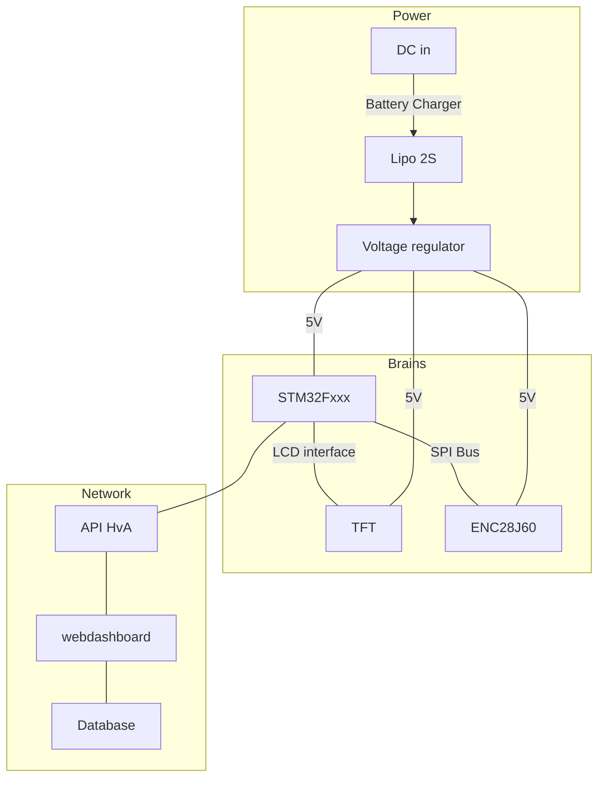

# Stefan de Kraker IoT individual project

# Overall design of the system

```mermaid
flowchart

subgraph Power
powerin[DC in] -- Battery Charger --> Lipo[Lipo 2S];
Lipo --> id1[Voltage regulator]
end

id1 -- 5V --- TFT
id1 -- 5V --- STM[STM32Fxxx]
id1 -- 5V --- ENC28J60

subgraph Brains
STM -- SPI Bus --- ENC28J60
STM -- LCD interface --- TFT
end

subgraph Network
STM --- API[API HvA]
API --- webdashboard
webdashboard --- Database
end

```