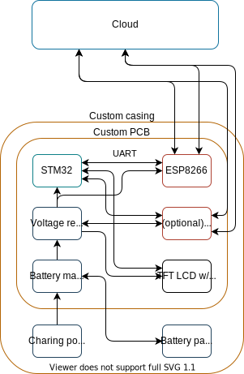

# Stefan de Kraker IoT individual project
For this individual project I have chosen for the blueprint: "To the moon".
This blueprint focus on making a device that keeps an eye on your savings in the crypto market.
Therefore I'm making a small embedded devices that will show this.
On this Gitlab repo you will find everything you need to know to about the project.

# Logbook
Read about the learning process in the [WIKI](https://gitlab.fdmci.hva.nl/IoT/2021-2022-sep-jan/individual-project/iot-krakers/-/wikis/Logbook)

# Learning Goals
Because of my background with technical computer science.
I have some knowledge regarding programming and hardware development.
To challenge myself I had the choice not to work with the Arduino IDE or framework.
I'm going to use a STM32 MCU and will work with there framework and IDE.
The next challenge is integrating a STM32 MCU on a custom PCB, to make a complete design.

# Overall hardware design of the system
For this Blueprint I will have made some hardware decisions that are fixed. 
This has to do with the challenge i'm gave myself.
## BOM
- ESP8266
- OLED display
- 2S battery pack
\
\

